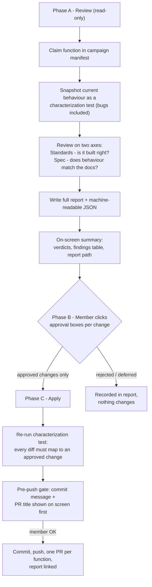

# dartrverse-skills

Claude Code skills for the dartRverse development team.

**Status: draft for team review.** The team agreed to use Claude Code to
improve and debug the 200+ functions of the dartRverse packages with one
standardised, partly automated procedure. This repository is that
procedure, written down and executable. Before the campaign starts, it
needs your feedback — [how to give it](#how-to-give-feedback) is below,
and the [open questions](#open-questions-for-the-team) list what is
genuinely undecided.

Current skills:

| Skill | Purpose |
|---|---|
| `dartr-function-review` (v1.3.1) | Review-and-improve workflow for one dartRverse function: advisory review → member approval → apply → PR |

## What the skill does

One invocation covers one function, end to end. The design principle,
borrowed from DArT's Morpheus review orchestrator: **the AI is advisory —
it never changes code on its own judgement.** Every change is approved by
a dartR member first, and behaviour-affecting changes require approval of
the *consequence*, stated in plain words, not just the fix.



### What a member actually sees

After the read-only review, the skill prints (1) two verdicts with one
driving sentence, (2) the path of the full report, and (3) a findings
table. From the trial run on `gl.report.callrate` (abridged):

| # | Issue | What happens | Proposed fix | Severity |
|---|---|---|---|---|
| 1 | Output ignores `verbose` | Full tables print even at `verbose = 0` | Gate at `verbose >= 3` — **changes console behaviour** | HIGH |
| 2 | Example uses `by.pop=TRUE`, which doesn't exist | Argument silently ignored; users think a per-population report ran | Remove the example lines (docs only) | HIGH |
| 3 | `method` never validated | `method="pop"` returns silently with no output | `match.arg(method)` | MEDIUM |

Then clickable approval boxes (Claude Code's native question dialog):
tick the changes you want, in batches; behaviour-changing items sit in
their own box so the consequence is approved explicitly; free-text
answers ("apply 2 and 3, defer 1") always work. Decisions are recorded
per finding in the report. After applying, the commit message and PR
title are shown on screen before anything is pushed.

### The three safety mechanisms

1. **Characterization baseline.** Before reading the code critically, the
   skill snapshots what the function *currently does* on `testset.gl` /
   `testset.gs` into a testthat file — bugs included. After applying
   fixes, every behavioural diff must map to an approved change; an
   unexplained diff stops the process. The baseline stays in `tests/`, so
   the campaign leaves a regression suite behind as a by-product.
2. **Escalation gate.** Changes to an argument's meaning or default, to
   numerical output, or to a signature require explicit approval of that
   consequence, plus a grep of the sibling `dartR.*` packages and
   dartr2shiny for callers, plus a NEWS entry. Motivated by a real case:
   `gl.filter.hamming`'s threshold changed from a proportion to a base
   count, and legacy calls with `threshold = 0.2` were silently truncated
   to 0.
3. **Golden fixtures.** `references/fixtures.md` lists five real
   historical bugs (e.g. `gl.filter.overshoot` keeping the loci it should
   have removed; the `pop.het` vector recycling). After any edit to the
   skill, it is re-run on a fixture to confirm it still finds the known
   defect — a review skill that silently degrades is worse than none.

### The findings vocabulary

Every finding cites a numbered rule (e.g. `DAT2` genotype–metadata sync,
`VRB3` warning gating), carries a severity (BLOCKER / HIGH / MEDIUM /
LOW / INFO), a confidence, and a concrete failure scenario — "could be
cleaner" is not a finding. Two verdicts are kept deliberately separate,
because a function can pass one and fail the other:

- **Standards** — is it built right? (structure, conventions, guards)
- **Spec** — is it the right thing? (does behaviour match the roxygen
  docs and the function's name)

## What's inside

```
skills/dartr-function-review/
  SKILL.md                  the workflow: phases, gates, escalation rules
  references/
    dartr-conventions.md    48 numbered rules the review cites
    report-contract.md      structure every report follows (+ JSON block)
    pr-template.md          MR title/body structure
    style.md                prose style (Google developer-docs base + team deltas)
    fixtures.md             historical bugs the skill must keep finding
```

The conventions catalogue was extracted from **"For the Developer"**
(Georges, Gruber & Mijangos 2021, v2) and modernised against the current
dartR.base codebase. Each rule is marked:

- **[confirmed]** (34 rules) — matches current code; the skill enforces it.
- **[proposed]** (14 rules) — modernisation awaiting team ratification;
  the skill reports against these but labels the findings "proposed rule"
  and never blocks on them.

**The proposed rules are the main thing needing your judgement.** The
consequential ones: `PLT2` (pick one plot-saving idiom —
`plot.file`/`plot.dir` vs `tempdir()`+`gl.list.reports()`; both coexist
today, ~35 vs ~60 files), `API1–API3` (back-compatibility policy — today
none is written down), `TST2–TST3` (snapshot-before-modify and
evidence-in-PR), `DAT6` (FBM-awareness / no needless densification),
`FS11` (`inherits()` over `class(x)[1]`). Full list and rationale in
`references/dartr-conventions.md`.

## Trial results (why we think this works)

- **`gl.report.callrate`** (full cycle, later reverted as it was a trial):
  9 findings including two HIGH — all printed output ignoring `verbose`,
  and documented examples calling a `by.pop` argument that does not exist
  (silently swallowed by `...`). One plausible finding (population-table
  misalignment with empty pop levels) was **killed during verification**
  — it does not reproduce because `pop()` drops unused levels — and is
  recorded as checked-and-cleared. That verify-before-report discipline
  is built into the workflow.
- **Fixture self-test**: run against the pre-fix `gl.filter.overshoot`,
  the review flags the inversion immediately (255 loci in, 21 out where
  234 were expected — the filter kept exactly the loci it should have
  removed).

The full trial report format is in
`references/report-contract.md`; a real filled-in example lives in
`dartR.base` at `function-review/reports/dartR.base/gl.report.callrate.md`
(on Luis's working tree until the campaign-infrastructure PR).

## Open questions for the team

1. Ratify or amend the 14 `[proposed]` conventions (see above).
2. `Config/testthat/edition: 3` in each package DESCRIPTION, or per-test
   `local_edition(3)`? (The campaign creates the first test suites.)
3. Where do campaign artifacts live — `function-review/` folder on `dev`
   (current assumption: manifest + reports, removed at campaign end), or
   somewhere else?
4. Scope check: per function, the skill fixes bugs + docs + conventions
   conformance; performance/FBM work only when it is itself a finding.
   Right scope?
5. Claiming: a `manifest.csv` on `dev` (current assumption) vs GitHub
   issues per function.
6. Transfer this repository to `green-striped-gecko` (currently private
   under `mijangos81` because Luis lacks org repo-creation rights).

## How to give feedback

- **On a rule**: open a GitHub issue titled with the rule ID
  (`DAT6: too strict for gl.dist.*`) — say what the rule gets wrong and
  what you would enforce instead.
- **On the workflow**: issue titled with the phase
  (`Phase B: approval batches too coarse`).
- **Concrete wording fixes**: PR straight to `main` — small and welcome.
- **Fastest of all**: install it (below), run
  `review <a function you maintain>` in a package checkout, stop after
  the on-screen summary (nothing is changed without your approval), and
  tell us where the findings were wrong, trivial, or missing. False
  positives and missed defects are the most valuable feedback there is —
  they become new fixtures.

## Install

Requires [Claude Code](https://claude.com/claude-code). Pick one:

**Personal install (recommended)** — available in every project:

```bash
git clone https://github.com/mijangos81/dartrverse-skills.git
ln -s "$(pwd)/dartrverse-skills/skills/dartr-function-review" ~/.claude/skills/
```

Update later with `git pull` — the symlink picks up changes automatically.
(The repository is private and will be transferred to `green-striped-gecko`
once org access is arranged; the clone URL will redirect after transfer.)

**Per-project install** — copy into a package checkout:

```bash
cp -r dartrverse-skills/skills/dartr-function-review /path/to/dartR.base/.claude/skills/
```

Verify: start Claude Code and ask `review gl.report.callrate` — the
`dartr-function-review` skill should announce itself.

## Use

In a Claude Code session inside a dartR.* package checkout:

- "review gl.report.callrate"
- "run the function review on gl.impute"
- "next function in the manifest"

Campaign state lives in the package repository, not here:
`function-review/manifest.csv` (who has claimed what) and
`function-review/reports/<package>/<function>.md` (the full reports).

## Contributing

- Edit on a branch, PR to `main`.
- Bump `version:` in `SKILL.md` in the same commit that changes behaviour
  (MAJOR: workflow or report contract change; MINOR: new checks or steps;
  PATCH: wording).
- After any edit to the skill or the conventions catalogue, re-run the
  review on one fixture from `references/fixtures.md` and confirm the
  listed defect is still found — a missed fixture is a regression in the
  skill.
- Rule changes in `dartr-conventions.md`: `[confirmed]` requires evidence
  from the current codebase; anything else enters as `[proposed]` until
  the team ratifies it.

## Team

dartRverse: https://github.com/green-striped-gecko/dartRverse
Questions: https://groups.google.com/d/forum/dartr
